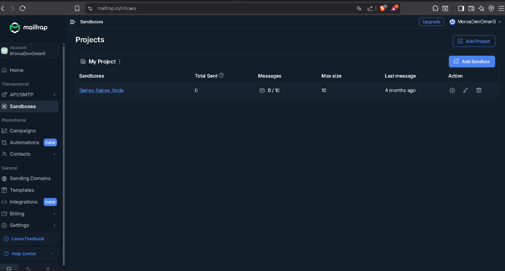
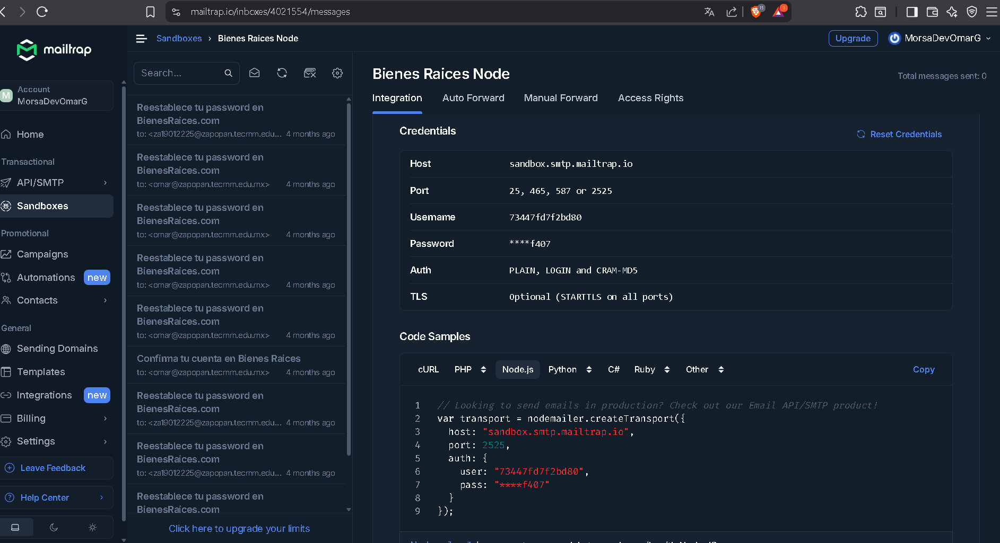

# Proyecto - UPTASK

- Administrador de Tareas

## Herramientas y/o Tecnologías

- MERN
  - Un _stack_ es un conjunto de herramientas para crear una app.
  - _fullstack_ quiere decir que puedes crear el _stack_ completo de una _app_ y _mern stack_ te permite hacerlo al igual que _PERN_.
  - Nuestro _backend_ sigue siendo _Node_ con _Express_ pero otras opciones son: _Nest.js o Fastify_.
    - MongoDB
      - Base de Datos _NoSQL_ orientada a **documentos** y grandes cantidades de datos.
      - Los datos son almacenados en un formato similar a _JSON_ (documentos) llamada: _BSON_.
      - Las tablas se llaman: **colecciones** y los registros: **documentos**.
      - **NOSQL**
        - Son base de datos no relacionales.
        - Están diseñadas específicamente para modelos de datos específicos y tienen esquema flexibles para crear aplicaciones modernas.
        - Este tipo de bases de datos son bastante comunes cuando hay una gran cantidad de transacciones de: **lectura/escritura** y cuando los datos no son uniformes o relacionados.
    - Express
      - **_npm i express_**
      - **_npm i -D @types/express_**
    - React
    - Node.js
- Nodemon
  - **_npm i -D nodemon_**
  - **_npm i -D ts-node_**
  - Una vez instalado, configuramos en: **package.json**
    - ```
      "scripts": {
        "test": "echo \"Error: no test specified\" && exit 1",
        "dev": "nodemon --exec ts-node src/index.ts"
      },  
    ```
  - Ejecutamos el comando:
    - **_npm run dev_**
  - Con ello todos los cambios que realicemos los estará mostrando en _consola_ sin necesidad de estar reiniciando o apuntando a llamar un archivo en específico.
- Typescript
  - **_npm i -D typescript_**
- Colors
  - **_ npm i colors_**
  - Sirve para poder personalizar los colores de las alertas o _logs_ en consola.
- Mongoose
  - **_npm i mongoose_**
  - _ODM_ para _MongoDB_.
  - Es un _ODM_ para _Node.js_.
  - _ORM: Object Relational Mapping_, en el caso de _ODM_ es lo mismo solo la D por _Document_ que es como _MongoDB_ se le conoce a la información almacenada en las colecciones.
  - _Mongoose_ es un _ODM_ que simplifica bastantes tareas y puede ser la herramienta más dura de este tipo en _Node.js_.
  - Al igual que _Sequelize_ se utilizan Modelos para diseñar los tipos de datos que tendrá nuestra información.
  - Tiene una gran cantidad de métodos para realizar las diferentes acciones del _CRUD_.
  - Se utiliza junto otras dependencias para manejar autenticación de usuarios, _has de password_ y más.
  - Consultar tipos de datos:
    - _https://mongoosejs.com/docs/schematypes.html_
- ENV
  - **_npm i dotenv_**
  - Sirve para crear variables de entorno.
- Arquitectura MVC
  - _Model View Controller_
  - Patrón de Arquitectura de _Software_ que permite la separación de oblifaciones de cada pieza de tu código.
  - Enfatiza la separación de la lógica de programación con la presentación.
  - _MVC_ es la arquitectura más común hoy en día tanto para _web_ y se utiliza en cualquier lenguaje.
  - ## VENTAJAS
    - Un mejor orden y escalabilidad en tu proyecto.
    - Al implementar una arquitectura probada como _MVC_ todos los programadores de un grupo saben exactamente donde encontrar el código ecargado de realizar alguna tarea.
    - Aprende _MVC_ y cualquier _Framework MVC_ te será fácil de aprender.
  - ### MODELO
    - Encargado de todo lo relacionado a los datos, Base de datos y el _CRUD_, el **MODELO** esta muy relacionado a tu _ORM u ODM_.
    - El **MODELO** se encargará de consultar una base de datos pero no se encarga de mostrar esos datos.
  - ### VIEW
    - Se encarga de todo lo que se ve en pantalla (HTML).
    - El **MODELO** se encargará de consultar la base de datos pero es la vista la que se encarga de mostrar los resultados.
    - En nuestro proyecto, _REACT_ es la vista.
  - ### CONTROLLER
    - Es el que comunica **MODELO y VISTA**, antes de que el modelo consulta la base de datos el **CONTROLADOR** es el encargado de llamarlo, una vez que el Modelo ya consultó la base de datos, es el **CONTROLADOR** quien le comunica a la vista los datos para que los muestre.
  - ### ROUTER
    - Es el encargado de registrar todas las _URL'S_ o _ENDPOINTS_ que soporta nuestra aplicación.
    - Ejemplo:
      - Si el usuario accede a una _URL_, el **ROUTER** ya tiene indicaciones de comunicarse con un _CONTROLADOR_ en específico, ese _Controlador_ ya sabe que _Modelo_ va a llamar y que vista va a ejecutar.
- Validator
  - **_npm i express-validator_**
  - Hacer validaciones con _Express Validator_.
- CORS
  - **_npm i cors_**
  - **_npm i -D @types/cors_**
- MORGAN
  - **_npm i morgan_**
  - **_npm i -D @types/morgan_**
- HASHEAR PASSWORD
  - **_npm i bcrypt_**
  - **_npm i -D @types/bcrypt_**
- MAILTRAIP
  - Instalación:
    - **_npm i nodemailer_**
    - **_npm i -D @types/nodemailer_**
    - _https://mailtrap.io/inboxes_
    - Presionamos dentro de la página:
      - _SanBoxes_
      - Si tenemos proyecto, damos click en él, como se mira en la imagen de abajo:
        - 
    - Elegimos la tecnología con la que trabajamos y copiamos el bloque de código que nos da, en este proyecto fue: **NODE.JS**
      - 
  - _https://mailtrap.io/_
  - Pruebas de envío de correos
  - Servicio para ya en **PRODUCCIÓN**
    - _resend.com_  

### Creación del proyecto

  - **_npm init --y_**

#### NESTED RESOURCE ROUTING

- Enrutamiento de Recursos Anidados, es un patrón de diseño en la construcción de _URLS_ para _APIS_, especialmente en _API'S RESTFUL_, donde las relaciones jerárquicas entre recursos son expresadas en la estructura de la _URL_.
- Este patrón es muy común en aplicaciones _web_ y _móviles_ que manejan datos relacionados en forma de recursos.
  - ## VENTAJAS
    - **/projects/:projectId/taks**
      - Si el proyecto existe
      - Si el usuario tiene permisos
      - Crear tareas en ese proyecto
- En _EXPRESS_ la forma de implementarlo es mediante: **MIDDLEWARE**.
  - ## MIDDLEWARE
    - Nos va a permitir darle un mejor orden a nuestras rutas para aplicar este patrón de diseño para las _URL'S_.
    - Debido a que los _Middleware_ se ejecutan en las peticiones _HTTP_ y antes del controlador, los hacen un gran lugar para poder ejecutar ciertas acciones referentes a si los proyectos existen o si el usuario tiene permisos para acceder a él.

### AUTENTICACIÓN

- Hoy en día no hay solo sitio web que sea utilizado por miles de usuarios que no tenga autenticación y registro de usuarios.
- Sitios de bancos, tiendas virtuales, aplicaciones de celular, todos tiene algún sistema de autenticación integrado.
- La autenticación nos permitirá identificar a nuestros usuarios y darles ciertos accesos a su información.

  ## PRINCIPIOS
    - Un usuario se puede autenticar con algo que él recuerda (Email y Password).
    - Se puede autenticar con un dispositivo físico (Mensaje SMS o alerta).
    - Se puede autenticar con algo físico (Huella Digital, Voz o Cara).

  ### ALGORITMO PARA CREAR CUENTA
    - Los usuarios deberán ser únicos, usualmente para crear una cuenta se pide el e-mail del usuario.
    - Los _password_ siempre deben estar **hasheados**.
    - Una buena forma de evitar llenarte de usuarios es enviar un enlace de verificación al e-mail y entonces el usuario deberá realizar alguna acción (también posible con tarjeta de crédito o número celular).
    - Una vez que el usuario crea su cuenta y la confirma, puede usar la app.

  ### ALGORITMO PARA INICIAR SESIÓN
    - La primer comprobación que debemos realizar es saber si el usuario existe o no.
    - La segunda es revisar si su cuenta ya ha sido confirmada.
    - La última es revisar si el _password_ es correcto, en caso de que si lo sea, el usuario es autenticado.

  ### ALGORITMO PARA REESTABLECER PASSWORD
    - La primer comprobación que debemos realizar es saber si el usuario existe o no.
    - Si el usuario existe se el envía un _Token_ que expira en 15 minutos.
    - El _Token_ es enviado vía e-mail y el usuario deberá visitar un enlace e ingresar ese _token_; si el _token_ es válido le permitimos reestablecer su _password_.

## JSON WEB TOKEN

  - **JWT** es un estándar abierto que define un formato compacto y seguro para transmitir información entre dos partes de manera segura como un objeto _JSON_.
  - ### VENTAJAS

    - **SEGURIDAD**
      - Utiliza algoritmos de firma digital para asegurar que los datos no han sido alterados durante la transmisión.
      - Esto garantiza la integridad de la información y permite a las partes confiar en su válidez.
    - **AUTENTICACIÓN Y AUTORIZACIÓN**
      - Se utiliza comúnmente para autenticar usuarios y permitirles acceder a recursos protegidos.
      - Una vez que un usuario ha sido autenticado correctamente, se le proporciona un _JWT_ que contiene información sobre sus permisos y roles.
      - El servidor puede verificar la válidez del _token_ y autorizar o reestringir el acceso.
    - **TRANSFERENCIA EFICIENTE DE DATOS**
      - _JWT_ es un formato compacto que se puede transmitir fácilmente a través de diferentes medios, como encabezados: _HTTP, URL_ o incluso en el cuerpo de una solicitud _HTTP_.
      - Esto lo hace adecuado para su uso en aplicaciones _Web_ y servicios de _API_.
    - **STATELESS (sin estado)**
      - Los _JWT_ son "sin estado", lo que significa que la información necesaria para autenticar y autorizar a un usuario se encuentre directamente en el _token_.
      - Esto elimina la necesidad de almacenar información de sesión en el servidor, lo que facilita la escalabilidad de las aplicaciones distribuidas.
      - Proporcionan un mecanismo seguro y eficiente para transmitir información entre dos partes, autenticar usuarios y autorizar el acceso a recursos protegidos en aplicaciones _web_ y servicios _API_.
      - Su naturaleza compacta, seguridad y facilidad de uso lo convierten en una opción popular para la implementación de sistemas de autenticación y autorización.
###
